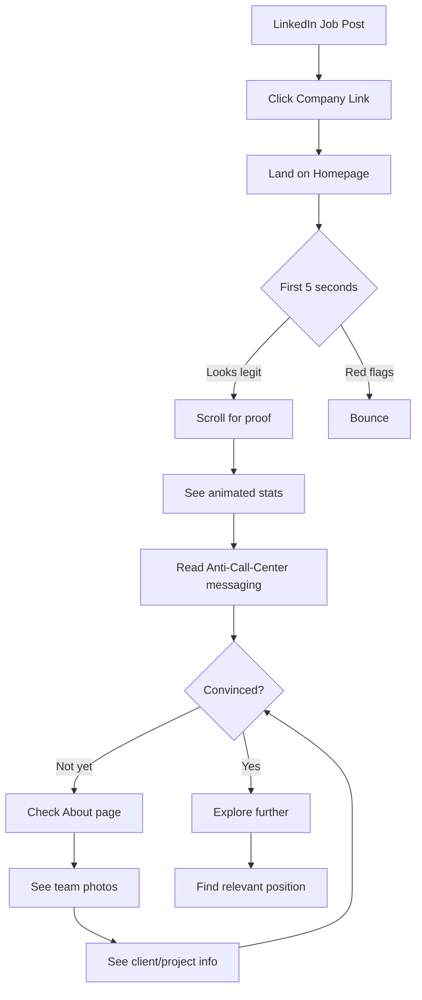
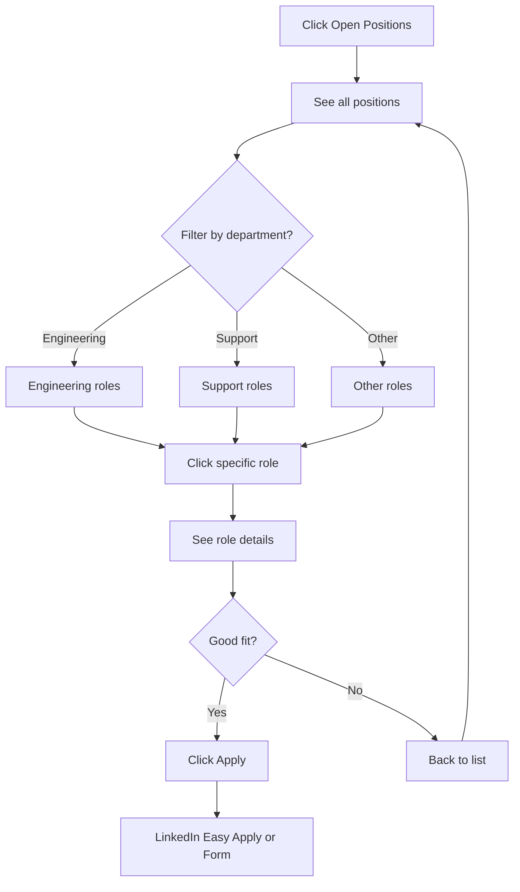
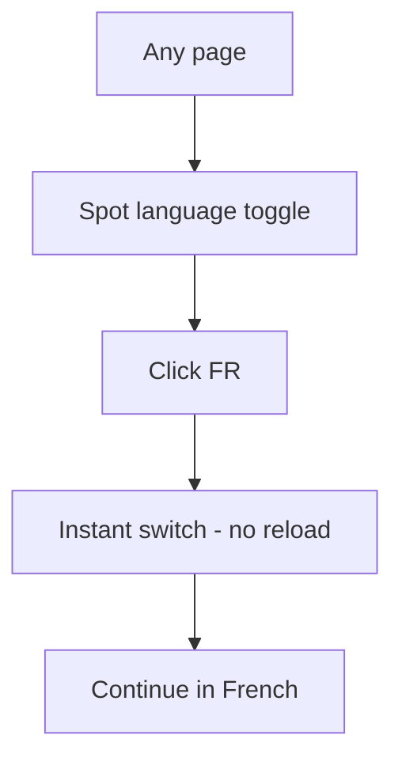
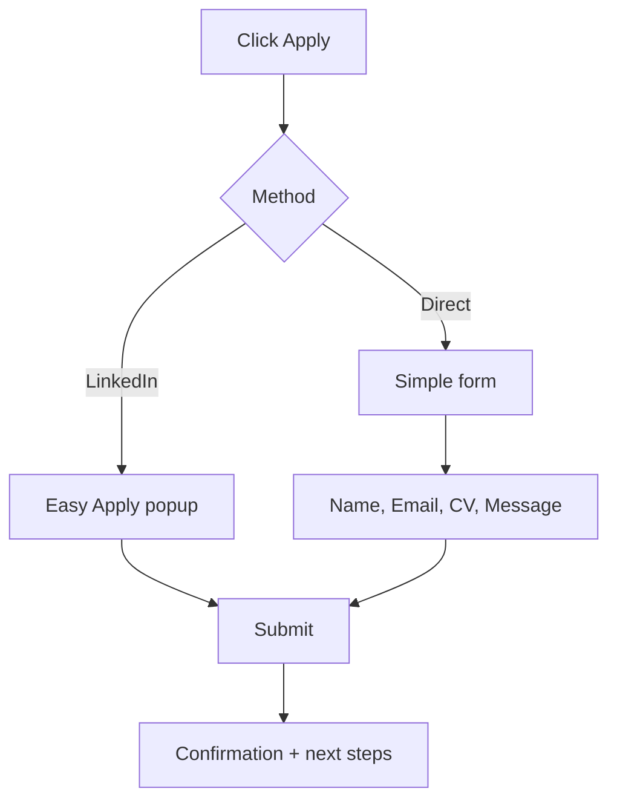

# UX Design Specification: Ozio Group

**Author:** Simon  
**Date:** 2026-01-22

---

## Early Requirements (Pre-Discovery Notes)

### User-Identified Requirements

1. **Open Positions Section** — Dedicated display of current job openings (beyond LinkedIn embed)
   - Clear listing of available roles by department
   - Should be distinct from spontaneous application form
   - Consider: filterable, searchable, or grouped by department

---

## Executive Summary

### Project Vision

A **static recruitment showcase website** serving as a credibility anchor for French-speaking talent in Israel. The site answers "Who is Ozio?" for candidates discovering the company on LinkedIn — not a content platform, but a single, well-crafted credibility document that differentiates Ozio from call centers and faceless multinationals.

**Core Positioning:** *"The Anti-Call-Center"* — transparency, real products, verifiable scale. Leading with what Ozio does because they're proud of it.

### Target Users

| Persona | Profile | What They Need from the Site |
|---------|---------|------------------------------|
| **Ambitious Newcomer** | Early-career (1-3 yrs), escaped/avoiding call centers | Proof this is real, what they'll actually do, growth path |
| **Skeptical Senior** | Experienced (5+ yrs), won't fall for empty promises | Numbers, specifics, no red flags |
| **Frustrated Call Center Veteran** | Mid-level (2-5 yrs), emotionally exhausted | Clear contrast with call centers, variety, team culture |

**Anti-Personas:** Scammer alumni, pure delegators, skill-limited hires

**Secondary Users:** HR partners, recruiters, LinkedIn connections doing due diligence

### Key Design Challenges

1. **Credibility in 5 seconds** — Site must immediately signal "not a call center" without being preachy
2. **Bilingual architecture** — FR primary / EN secondary with clean language switching that doesn't feel clunky
3. **Proof without bragging** — Display numbers (€15M ARR, 25K requests, 2000 artisans) in a way that feels authentic, not boastful
4. **Self-selection UX** — Design that attracts right-fit candidates while naturally filtering out wrong-fit
5. **Open Positions display** — Clear, scannable job listings beyond just a LinkedIn embed

### Design Opportunities

1. **Tone as differentiator** — Direct, demanding, fair. The copy *style* can repel wrong candidates and attract right ones
2. **The "Soul" story** — The mother locked out at 2AM, the technician who can finally eat — emotional proof points that humanize the marketplace
3. **Visual contrast** — Modern, professional design that visually says "we're not a boiler room"
4. **Department storytelling** — Each team (Tech, Marketing, Sales, Ops, Support) can have its own mini-narrative

---

## Core User Experience

### Defining Experience

**Core Flow:**  
`LinkedIn job post → Land on site → Validate credibility → Find relevant position → Apply`

**Primary User Action:** Scan for proof points, confirm "this is real," then convert.

The site is not a product to use — it's a **credibility document to consume**. Success = candidate moves from skeptical to convinced in under 2 minutes.

### Platform Strategy

| Requirement | Decision |
|-------------|----------|
| **Approach** | Mobile-first responsive |
| **Primary devices** | Mobile (LinkedIn browsing), Desktop (deeper research) |
| **Offline** | Not required — static site |
| **Performance** | Speed is critical — fast loads, no friction |

### Effortless Interactions

Everything must feel **seamless**:

- **Language switching** — Instant, no page reload, persistent preference
- **Page navigation** — Smooth transitions, clear wayfinding, no dead ends
- **Speed** — Sub-second loads, no spinners, images optimized
- **Finding positions** — Clear department grouping, scannable listings
- **Applying** — Minimal clicks from "interested" to LinkedIn application

### Critical Success Moments

| Moment | What Happens |
|--------|--------------|
| **First 5 seconds** | Candidate sees professional design + clear messaging → "Not a call center" |
| **30 seconds** | Candidate sees proof points (€15M, 25K requests, 9 years) → "These guys are real" |
| **1-2 minutes** | Candidate finds relevant department/position → "I could work here" |
| **Conversion** | Candidate clicks apply → "Let's do this" |

**The Make-or-Break:** The proof points. If they believe the numbers, they apply.

### Experience Principles

1. **Credibility First** — Every element builds trust; nothing feels salesy
2. **Speed is Respect** — Fast site = professional company
3. **Seamless Bilingual** — FR/EN switching should be invisible friction
4. **Self-Selection by Design** — The right candidates stay, wrong ones leave early (both are wins)
5. **Mobile Reality** — Most will discover on phone; design for thumb-scrolling

---

## Desired Emotional Response

### Primary Emotional Goals

**Primary:** *Trust and Confidence* — "This is a real company with real opportunity"

**Supporting Emotions:**
- **Relief** — Escape from call center anxiety
- **Respect** — Being treated like an adult, not a number
- **Aspiration** — "I could build something here"

**Emotions to Avoid:**
- **Skepticism** — "This sounds too good to be true"
- **Confusion** — "What do they actually do?"
- **Pressure** — "They're trying too hard to sell me"

### Emotional Journey Mapping

| Stage | Target Emotion | Trigger |
|-------|----------------|---------|
| **First impression** | *Relief* | "Finally, something that doesn't feel sketchy" |
| **Reading proof points** | *Trust* | "These numbers are real, this is legit" |
| **Exploring departments** | *Curiosity* | "What would MY role look like here?" |
| **Seeing culture/soul** | *Connection* | "These people get it, this resonates" |
| **Finding a position** | *Excitement* | "I could actually do this" |
| **Clicking apply** | *Confidence* | "I'm making a smart move" |

### Micro-Emotions

| Positive (Cultivate) | Negative (Avoid) |
|---------------------|------------------|
| Confidence | Confusion |
| Trust | Skepticism |
| Excitement | Anxiety |
| Belonging | Isolation |
| Accomplishment | Frustration |

### Design Implications

| Emotional Goal | UX Approach |
|----------------|-------------|
| **Trust** | Show numbers without hype, clean professional design, no stock photos of fake smiling people |
| **Relief** | Anti-call-center messaging early, specific about what the work IS |
| **Respect** | Direct copy, no fluff, treat them as intelligent adults |
| **Confidence** | Clear paths, no hidden information, easy to verify claims |
| **Connection** | Real stories (mother locked out, technician success), human voice |

### Emotional Design Principles

1. **Authenticity Over Polish** — Real > Perfect. Genuine voice beats corporate speak.
2. **Substance Before Style** — Proof points first, pretty later.
3. **Respect Intelligence** — No manipulation, no urgency tricks, no "limited positions!"
4. **Earn Trust** — Every claim should feel verifiable.
5. **Create Relief** — The design itself should signal "we're different."

---

## UX Pattern Analysis & Inspiration

### Inspiring Products Analysis

**1. Apple (apple.com)**
- **What they do well:** Scroll-triggered animations, cinematic reveals, products feel like events
- **UX pattern:** Content unfolds as you scroll — each section is a "moment"
- **Emotional impact:** Premium, confident, "we don't need to try hard"
- **Transferable:** Animation timing, reveal sequences, dramatic spacing

**2. GitHub (github.com homepage)**
- **What they do well:** Tech credibility through design language, code aesthetics, developer-friendly polish
- **UX pattern:** Dark mode energy, glowing accents, terminal/code visual motifs
- **Emotional impact:** "Built by people who know what they're doing"
- **Transferable:** Tech aesthetic without being cold, serious without being corporate

**Combined Vision:** *Apple's cinematic experience + GitHub's tech credibility = "Holy shit, these guys are serious"*

### Transferable UX Patterns

| Pattern | Source | How to Apply |
|---------|--------|--------------|
| **Scroll-triggered animations** | Apple | Proof points animate in as you scroll, numbers count up |
| **Cinematic section reveals** | Apple | Each page section is a "scene" that unfolds |
| **Tech aesthetic** | GitHub | Code-inspired typography, glowing accents, dark mode option |
| **Confident whitespace** | Both | Let content breathe — no cramming |
| **Motion as meaning** | Both | Animations aren't decoration, they guide attention |

### Anti-Patterns to Avoid

| Anti-Pattern | Why It Fails | What We Do Instead |
|--------------|--------------|---------------------|
| **Corporate stock photos** | Screams "we're hiding something" | Real photos or abstract visuals |
| **Generic Bootstrap templates** | Signals cheap/temporary | Custom, polished design |
| **Static, flat pages** | Forgettable, no "wow" | Animation-rich, memorable experience |
| **Busy, cluttered layouts** | Feels desperate | Confident spacing, editorial restraint |
| **Fake urgency ("Apply now!")** | Call center energy | Calm confidence |

### Design Inspiration Strategy

**Adopt:**
- Apple-style scroll animations and cinematic reveals
- GitHub's tech credibility aesthetic
- Bold typography, dramatic spacing
- Dark mode energy (or at least dark accents)

**Adapt:**
- Scale down complexity (5-page site, not product launch)
- Ensure mobile performance isn't sacrificed for animation
- Balance "wow" with fast load times

**Avoid:**
- Anything that feels "corporate careers page"
- Generic, template-y layouts
- Static, forgettable design

---

## Design System Foundation

### Design System Choice

**Recommended Stack:** Tailwind CSS + Framer Motion (React/Next.js) or Tailwind CSS + GSAP (vanilla/Astro)

**Approach:** Custom design system built on utility-first foundation with animation-native libraries.

### Rationale for Selection

| Factor | Decision Driver |
|--------|-----------------|
| **Visual Vision** | Apple-style animations + GitHub tech credibility requires full control |
| **Animation Requirements** | Scroll-triggered reveals, cinematic transitions need animation-first tooling |
| **Site Scope** | 5-page static site doesn't need component library overhead |
| **Performance** | Both Framer Motion and GSAP are optimized for 60fps mobile performance |
| **Customization** | No preset aesthetic to fight against — you define the look |

### Implementation Approach

| Layer | Tool | Purpose |
|-------|------|---------|
| **Styling** | Tailwind CSS | Utility classes, responsive design, dark mode |
| **Animation** | Framer Motion or GSAP | Scroll-triggered reveals, page transitions, micro-interactions |
| **Components** | Custom-built | Minimal components, each crafted for specific needs |
| **Icons** | Lucide or custom | Clean, modern iconography |

### Customization Strategy

**Design Tokens:**
- Color palette with dark mode support
- Typography scale (bold, modern, tech-forward)
- Spacing system with generous whitespace
- Animation timing presets

**Animation System:**
- Reusable animation variants (fade-in, slide-up, stagger)
- Scroll-triggered reveal components
- Page transition patterns
- Number counter animations for proof points

**Component Strategy:**
- Build only what's needed
- Each component animation-ready by default
- Mobile-first responsive behavior

---

## Defining Experience

### Core Interaction

**The Defining Experience:** *"Scroll through proof that this is real, and feel the relief of finding something legitimate."*

This is a consumption experience, not a task-completion app. Success = candidate's mental state shifts from skeptical to convinced.

### User Mental Model

**How candidates approach career sites:**
1. See job post on LinkedIn → "Is this real or another scam?"
2. Click company link → Scan for red flags
3. Look for numbers, specifics, proof → "Can I verify this?"
4. Check culture signals → "Would I fit here?"
5. Find relevant position → "Is there something for me?"
6. Decide → Apply or bounce

**Expectations:**
- Quick answers to "What do you actually do?"
- Proof that scales with skepticism (seniors need more proof)
- Clear path from "interested" to "applied"

**Frustration points:**
- Vague corporate speak with no substance
- Hidden information (industry, what the work is)
- Dead ends or broken job links

### Success Criteria

| Criteria | Measurement |
|----------|-------------|
| **Speed to proof** | Key numbers visible within 5 seconds of landing |
| **Clarity** | "What they do" understood in 30 seconds |
| **Self-selection** | Wrong-fit candidates bounce early (this is good) |
| **Conversion confidence** | Apply button clicked with conviction, not desperation |

### Experience Mechanics

**1. Initiation:**
- User lands from LinkedIn job post
- Hero section immediately signals "not a call center" through design + messaging

**2. Interaction:**
- Scroll-driven experience — content reveals as they progress
- Proof points animate in (numbers count up, sections fade/slide in)
- Clear navigation if they want to jump to specific sections

**3. Feedback:**
- Visual momentum — each scroll reveals more, creates engagement
- Numbers feel substantial (animated counters, bold typography)
- Department/position discovery feels organized and complete

**4. Completion:**
- Find relevant position → Clear CTA to apply (LinkedIn or form)
- No dead ends — every page has a next step
- Language toggle always accessible

### Novel UX Patterns

**Established (use these):**
- Hero → Proof → Story → Careers → Apply flow
- Animated number counters for credibility
- Department filtering/grouping

**Novel twist (differentiation):**
- Apple-level scroll animations make a "boring" career site feel premium
- The animation quality itself is a proof point ("these guys are serious")
- Dark mode / tech aesthetic signals "we're builders, not a call center"

---

## Visual Design Foundation

### Color System

**Mode:** Dark mode primary

**Base Palette:**
- **Background:** Near-black (#0a0a0a to #121212)
- **Surface:** Slightly elevated dark (#1a1a1a to #1f1f1f)
- **Text Primary:** White (#ffffff)
- **Text Secondary:** Gray (#a0a0a0)

**Accent Strategy:** Tech blue or vibrant gradient (blue→purple or blue→cyan) — signals serious tech company while creating visual interest.

**Semantic Colors:**
- Accent/Primary: Electric blue (#0066FF) or gradient
- Success: Green with dark mode optimization
- Error: Red with dark mode optimization
- Warning: Amber with dark mode optimization

### Typography System

**Direction:** Bold and geometric (tech/modern)

**Font Stack:**
- **Headlines:** Inter, Geist, or Space Grotesk — bold weights, geometric shapes
- **Body:** Same family at regular weight for consistency
- **Monospace (optional):** JetBrains Mono for any code/tech elements

**Type Scale:**
- Hero headlines: 4xl-6xl (bold, dramatic)
- Section headers: 2xl-3xl (bold)
- Body: Base-lg (comfortable reading on dark backgrounds)
- Captions: sm (muted gray)

### Spacing & Layout Foundation

**Approach:** Generous, Apple-style — content breathes

- **Base unit:** 8px
- **Section padding:** 80-120px vertical (dramatic breathing room)
- **Content max-width:** 1200-1400px (controlled reading width)
- **Element spacing:** Generous gaps between components

**Layout Principles:**
1. Let content breathe — no cramming
2. Each section is a "scene" with clear boundaries
3. Mobile: Stack gracefully, maintain generous padding

### Brand Assets

**Logo:**
- `logo_ozio.png` — White version (for dark backgrounds)
- `logo_ozio_black.png` — Black version (for light backgrounds)
- Style: Bold geometric wordmark with diagonal slash — modern, tech-forward

**Team Photography:**
- Office space photos (modern workspace with character)
- Team outing photos (winery visits, real culture moments)
- Authentic, not corporate stock — credibility proof

**Asset Location:** `/assets/`

### Imagery Strategy

**Approach:**
- Real team photos for culture sections (provided)
- Abstract geometric backgrounds (gradients, subtle patterns)
- Minimal/no stock imagery
- Logo prominently featured on dark backgrounds

### Accessibility Considerations

- WCAG AA contrast ratios on dark backgrounds (minimum 4.5:1 for text)
- Text remains readable at all sizes
- Animation respects `prefers-reduced-motion`
- Focus states visible on dark mode
- Language toggle always accessible

---

## Design Direction Decision

### Design Directions Explored

Four color/accent directions were explored, all sharing:
- Dark mode primary (#0a0a0a base)
- Space Grotesk headlines (bold, geometric)
- Generous Apple-style spacing
- Card-based components with hover states

**Directions explored:**
1. **Electric Blue** — GitHub-like, tech-forward, clean (#0066FF)
2. **Vibrant Gradient** — Dynamic blue→purple→pink gradient
3. **Emerald Pop** — Green/emerald, growth-focused
4. **Warm Tech** — Orange/amber, energetic and bold

### Chosen Direction

**Direction 4: Warm Tech**

**Primary Accent:** Orange/Amber (#F59E0B)
**Gradient:** Orange → Red (#F59E0B → #EF4444)
**Accent Glow:** rgba(245, 158, 11, 0.3)

### Design Rationale

- **Differentiation:** Orange stands out from typical tech blue — immediately signals "we're different"
- **Energy:** Warm colors convey approachability and energy while maintaining professionalism
- **Boldness:** Aligns with the "wow effect" goal — orange on dark is striking and memorable
- **Balance:** Combined with dark backgrounds and geometric typography, warmth doesn't feel unprofessional

### Updated Color System

**Base Palette:**
- **Background:** #0a0a0a (near-black)
- **Surface:** #1a1a1a (elevated dark)
- **Elevated:** #242424 (card backgrounds)
- **Text Primary:** #ffffff
- **Text Secondary:** #a0a0a0

**Accent Colors:**
- **Primary:** #F59E0B (amber)
- **Secondary:** #EF4444 (red, for gradient)
- **Gradient:** linear-gradient(135deg, #F59E0B 0%, #EF4444 100%)
- **Glow:** rgba(245, 158, 11, 0.3)

### Implementation Approach

- Apply orange accent to CTAs, badges, stat numbers, section labels
- Use gradient for hero text highlights and primary buttons
- Maintain dark backgrounds throughout
- Orange glow on hover states for depth
- Keep semantic colors standard (success green, error red distinct from accent)

**Reference:** `_bmad-output/planning-artifacts/ux-design-directions.html` (Direction 4)

---

## User Journey Flows

### Journey 1: Credibility Validation (Primary)

**User:** Skeptical professional who saw a LinkedIn job post  
**Goal:** Determine if Ozio is legitimate before investing time

**Key UX Moments:**
- 0-5 sec: Dark mode + bold typography signals "tech company"
- 5-15 sec: Animated numbers count up — proof is visceral
- 15-30 sec: Anti-call-center messaging confirms differentiation

### Journey 2: Position Discovery

**User:** Validated candidate looking for their role  
**Goal:** Find a relevant open position

### Journey 3: Language Toggle

**User:** French-speaking user preferring French  
**Goal:** Switch language seamlessly

**Key:** Instant, no page reload, preference remembered

### Journey 4: Apply Flow

**User:** Convinced candidate ready to apply  
**Goal:** Submit application with minimal friction

### Journey Patterns

**Navigation Patterns:**
- Sticky nav with logo, links, language toggle
- Clear CTAs on every page (no dead ends)
- Scroll-triggered section reveals

**Feedback Patterns:**
- Animated number counters on scroll
- Hover glow on cards (orange accent)
- Instant language switch
- Real-time form validation

**Error Recovery:**
- Form errors shown inline, not blocking
- 404 page with navigation back to jobs
- Always provide escape hatch to jobs list

### Flow Optimization Principles

1. **Speed to proof:** Key numbers visible within 5 seconds
2. **Minimal clicks:** 2 clicks from homepage to apply button
3. **No dead ends:** Every page has clear next action
4. **Mobile-first:** Large tap targets, thumb-friendly nav

---

## Component Strategy

### Design System Foundation

**Stack:** Tailwind CSS + Framer Motion/GSAP  
**Approach:** All components custom-built for full animation control

### Navigation Components

| Component | Purpose | Animation |
|-----------|---------|-----------|
| **Navbar** | Sticky nav with logo, links, lang toggle | Blur backdrop on scroll |
| **LanguageToggle** | EN/FR switcher | Instant switch, no reload |
| **MobileMenu** | Full-screen canvas overlay | Slide-in takeover, full viewport |

**MobileMenu Specification:**
- Full screen canvas (100vh × 100vw)
- Dark background with blur
- Large, thumb-friendly navigation links
- Language toggle prominent
- Close button in corner
- Body scroll locked when open

### Hero Components

| Component | Purpose | Animation |
|-----------|---------|-----------|
| **HeroBadge** | "We're hiring" pill with pulse dot | Pulse animation on dot |
| **HeroHeadline** | Large gradient text headline | Fade-in on load |
| **HeroCTA** | Primary + secondary buttons | Hover glow, lift on hover |

### Proof Components

| Component | Purpose | Animation |
|-----------|---------|-----------|
| **StatCounter** | Animated number with label | Count-up on scroll-into-view |
| **StatsGrid** | 4-column stats layout | Stagger reveal |

### Content Components

| Component | Purpose | Animation |
|-----------|---------|-----------|
| **SectionHeader** | Label + title for sections | Fade-up on scroll |
| **FeatureCard** | Icon + title + description | Hover: lift + border glow |
| **TeamPhoto** | Image with optional caption | Fade-in, subtle zoom on hover |

### Jobs Strategy

**Approach:** LinkedIn-first — keep job discovery on LinkedIn, not custom job listing system.

**Components:**
| Component | Purpose |
|-----------|---------|
| **LinkedInEmbed** | Embedded LinkedIn jobs widget |
| **JobsCTA** | "View all positions on LinkedIn" button |

**Rationale:**
- Reduces maintenance (no job data to sync)
- LinkedIn is where candidates already are
- Simpler UX — one click to LinkedIn
- Positions section shows proof of hiring activity, not full job board

### Form Components

| Component | Purpose | Animation |
|-----------|---------|-----------|
| **ContactForm** | Simple contact/interest form | Field focus glow |
| **FormInput** | Styled input with validation | Error shake, success check |
| **SubmitButton** | Form submit CTA | Loading state, success state |

### Footer Components

| Component | Purpose |
|-----------|---------|
| **Footer** | Logo, links, LinkedIn, copyright |

### Critical Component Specifications

**StatCounter:**
- Count from 0 to target over 1.5s
- Trigger on scroll into viewport
- Variants: suffix (+, %, years)
- Gradient text, bold typography

**LanguageToggle:**
- Instant content swap (no reload)
- Pill toggle style
- Always visible in navbar

**MobileMenu (Canvas):**
- Full viewport takeover
- Animated entrance (slide or fade)
- Large touch targets
- Escape/close always accessible

### Implementation Roadmap

**Phase 1 — MVP:**
- Navbar + LanguageToggle + MobileMenu (canvas)
- HeroHeadline + HeroCTA
- StatCounter + StatsGrid
- LinkedIn Jobs CTA
- Footer

**Phase 2 — Full Experience:**
- FeatureCard + SectionHeader
- TeamPhoto gallery
- Page transitions
- Contact form

**Phase 3 — Polish:**
- Loading states
- Error pages
- Animation refinements

---

## UX Consistency Patterns

### Button Hierarchy

| Level | Use | Style |
|-------|-----|-------|
| **Primary** | Main CTA (View Positions, Apply) | Gradient fill (orange→red), white text, glow on hover |
| **Secondary** | Alternative actions (About Us, Contact) | Transparent, white border, white text |
| **Ghost** | Tertiary actions (Back, Cancel) | No border, text only, underline on hover |

**Hover Behavior:**
- Primary: Lift 2px + orange glow shadow
- Secondary: Background fill (dark surface)
- Ghost: Underline appears

**Mobile:** Minimum 48px height, full-width on small screens

### Feedback Patterns

| Type | When | Visual |
|------|------|--------|
| **Success** | Form submitted | Green checkmark + confirmation message |
| **Error** | Validation failed | Red border + inline message |
| **Loading** | Waiting for response | Spinner in button, button disabled |

**Animation:**
- Success: Check icon scales in
- Error: Subtle shake (200ms)
- Loading: Spinner rotation

### Form Patterns

**Input Fields:**
- Dark surface background (#1a1a1a)
- White text, orange border on focus
- Inline validation (real-time)

**Validation:**
- Show errors only after blur or submit attempt
- Error message below field, not tooltip

**Submit:**
- Disable button while submitting
- Show spinner inside button
- Replace with success message on completion

### Navigation Patterns

**Navbar:**
- Sticky on all pages
- Blur backdrop on scroll (glassmorphism)
- Logo left, links center, language toggle right

**Mobile Menu (Canvas):**
- Full viewport (100vh × 100vw)
- Dark background + blur
- Links stacked vertically, large text
- X close button top-right
- Body scroll locked

**Page Transitions:**
- Fade between pages (300ms)
- No jarring jumps

### Animation Patterns

**Scroll Reveals:**
- Fade in + slide up (20px)
- Stagger delay: 100ms between items
- Trigger: 20% into viewport
- Duration: 500ms, ease-out

**Number Counters:**
- Trigger on scroll into view
- Duration: 1.5s, ease-out
- Count from 0 to target

**Hover States:**
- Duration: 200ms, ease
- No delay

**Reduced Motion:**
- Respect `prefers-reduced-motion`
- Fallback: instant appearance

### Link Patterns

**Internal Links:** White text, underline on hover  
**External Links:** Opens in new tab, arrow icon suffix

---

## Responsive Design & Accessibility

### Responsive Strategy

**Approach:** Mobile-first

**Mobile (320px - 767px):**
- Single column layouts
- Full-width cards and sections
- Canvas mobile menu (full viewport)
- Large touch targets (48px)
- Stats in 2×2 grid

**Tablet (768px - 1023px):**
- 2-column layouts where appropriate
- Stats in 4-column row

**Desktop (1024px+):**
- Max-width container (1400px, centered)
- 3-column feature grids
- Horizontal navigation
- Generous whitespace (80-120px section padding)

### Breakpoint Strategy

Using Tailwind defaults (mobile-first):
- **md:** 768px — 2-col layouts
- **lg:** 1024px — Full desktop nav, 3-col grids
- **xl:** 1280px — Max-width container

### Accessibility (Minimal)

- Semantic HTML structure
- Respect `prefers-reduced-motion` for animations
- Keyboard-focusable interactive elements
- `lang` attribute for FR/EN switching

*Note: Full WCAG compliance not prioritized for MVP.*

---

<!-- Content complete -->
